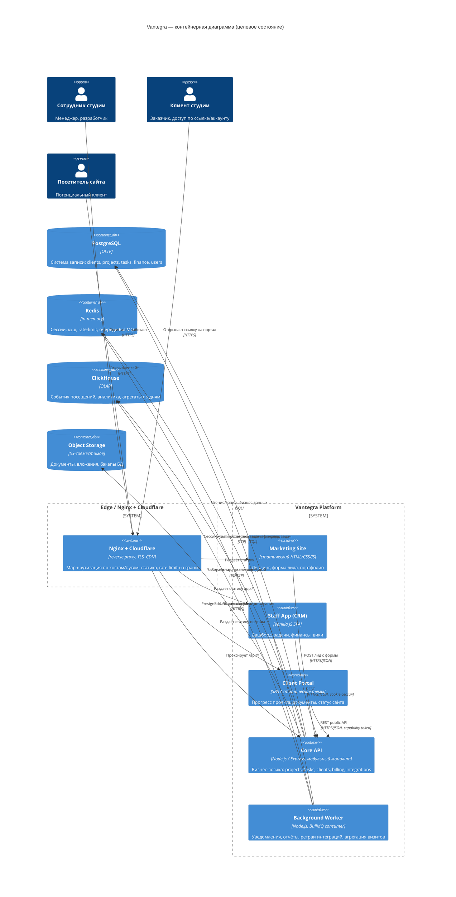

# Целевая архитектура и план эволюции Vantegra CRM

Документ подготовлен как основа для инженерной работы. Это не продукт «продай CRM», а разбор конкретной системы студии Vantegra: монолит Express + SQLite (v1.3.0), клиентский портал по токену, публичный лендинг vantegracode.ru — и путь к операционной системе студии на PostgreSQL + Redis + ClickHouse без остановки прод-системы и без потери данных.

---

## 1. Executive summary

**Целевая архитектура в 10 тезисах**

1. Модель развития — **эволюция, не переписывание**. Текущий `server.js` остаётся ядром на первых фазах; рефакторинг идёт по модулям параллельно с фичами, а не «стоп на 3 месяца».
2. Основная стратегия деплоя — **модульный монолит внутри монорепозитория** (pnpm workspaces), а не микросервисы. Причина — команда 2–5 человек, для которой операционная сложность распределённой системы обходится дороже, чем выгода от независимого масштабирования, которого пока не требуется ([Wojciechowski, Microservices vs Monolith Decision Framework 2025](https://wojciechowski.app/en/articles/microservices-vs-monolith-2025); [DebuggAI, Modular Monolith vs Microservices 2025](https://debugg.ai/resources/modular-monolith-vs-microservices-2025-consolidation-and-tooling-playbook)).
3. Три системы хранения разделены по назначению: **PostgreSQL** — единственная система записи для бизнес-данных (OLTP), **Redis** — сессии/кэш/очереди/rate-limit (эфемерные данные), **ClickHouse** — только аналитика и события «только на чтение агрегатами», никогда не источник истины для бизнес-логики.
4. Один бренд, три поверхности на **одном домене**: `vantegracode.ru` (лендинг), `app.vantegracode.ru` (кабинет сотрудников), `p.vantegracode.ru/{token}` или `vantegracode.ru/c/{token}` (клиентский портал) — конкретная рекомендация ниже, в разделе 4.
5. Токен клиента в query string — это уязвимость на проде уже сегодня (утечка в Referer, логах Nginx, истории браузера); переход на **capability URL по пути + короткий TTL + возможность отзыва** обязателен на фазе 0–1, до Postgres ([W3C TAG, Capability URLs](https://www.w3.org/2001/tag/doc/capability-urls/)).
6. Миграция SQLite → PostgreSQL делается **pgloader + короткое окно обслуживания** (не dual-write — для команды из 1–2 разработчиков dual-write на проде — источник рассинхронизации данных, а не экономии простоя) ([pgloader docs](https://pgloader.readthedocs.io/en/latest/ref/sqlite.html)).
7. Клиент становится **отдельной сущностью** (`clients`, `client_users`, `client_access_links`) до того, как наращивать функциональность портала — иначе каждая новая фича консервирует текущий технический долг («один проект = один токен = один клиент»).
8. Изоляция данных клиентов на уровне Postgres — **на уровне приложения** (`client_id`/`project_id` в каждом запросе + индексы), не Row-Level Security на первом этапе: RLS даёт защиту от багов приложения ценой сложности отладки и производительности на команде без выделенного DBA ([AWS Database Blog, Multi-Tenant Data Isolation with RLS](https://aws.amazon.com/blogs/database/multi-tenant-data-isolation-with-postgresql-row-level-security/)); включить RLS как вторую линию защиты можно позже, когда схема стабилизируется.
9. Один VPS с Docker Compose (Postgres + Redis + ClickHouse + приложение + Nginx) выдержит студию все ближайшие 1–3 года при текущих объёмах; Kubernetes и микросервисы не нужны, пока нет второго измерения нагрузки (не «клиентов стало больше», а «конкретный компонент физически упирается в CPU/IO одного узла»).
10. Frontend не переписывается тотально: CRM остаётся на Vanilla JS дольше всего (сотрудники привыкли, ROI переписывания низкий), а **новый общий UI-kit** (токены дизайна, CSS-переменные, возможно Web Components) шарится между лендингом, новым клиентским порталом и точечными новыми экранами CRM.

**Что делать в ближайшие 30 дней (Фаза 0)**

- Зафиксировать текущие REST-контракты `server.js` в OpenAPI-описании (даже неполном) — это единственный способ безопасно резать монолит дальше.
- Убрать токен клиента из query string в путь URL, добавить `expires_at` и возможность мгновенного revoke в таблице `sessions`/новой `client_access_links` — без этого любое дальнейшее развитие портала расширяет площадь риска.
- Закрыть публичный `PUT /api/public/client/:token/site` rate-limit’ом и валидацией (сейчас это open write без auth сотрудника).
- Поставить Postgres, Redis, ClickHouse в Docker Compose рядом (staging), не переключая прод — снять миграционный риск с продуктовых решений.
- Договориться с командой о границах будущих модулей (раздел 5) до того, как писать код, — иначе рефакторинг разъедется по живым local-переменным `server.js`.

---

## 2. Gap-анализ CRM

Оценка приоритета: **P0** — блокирует операционные риски или безопасность, делать в первую очередь; **P1** — нужно в течение 2–3 месяцев для роста; **P2** — желательно в течение года; **P3** — рано для команды 2–5 человек, не делать сейчас.

| Модуль | Есть сейчас (v1.3.0) | Чего не хватает | Приоритет | Зачем |
|---|---|---|---|---|
| Клиент как сущность | `projects.client` — строка | Таблица `clients`, привязка нескольких проектов к одному клиенту | P0 | Без этого невозможен единый кабинет клиента с историей всех его проектов, невозможна нормальная биллинг-история |
| Пользователи клиента | Нет (доступ по токену проекта) | `client_users` — несколько людей у одного заказчика, разные роли (владелец, бухгалтер, контент-менеджер) | P1 | Заказчики — не один человек; сейчас все, у кого есть ссылка, видят и делают одно и то же |
| Портал по ссылке | Токен в query, 17 тем UI, PUT site без auth, счётчик визитов без защиты | TTL токена, revoke, rate limit, серверная валидация site URL, разделение preview/боевого токена | P0 | Действующая уязвимость: утечка токена = полный доступ к статусам проекта третьим лицам |
| Договоры / счета / акты / ЭДО | Нет | Минимум: хранение договора как документа + статус оплаты; ЭДО — не first-class на первом этапе | P2 (базовый учёт), P3 (полноценный ЭДО) | Критично для бухгалтерии, но не блокирует операционку разработки; интеграция с оператором ЭДО — отдельный дорогой проект |
| Учёт времени | Нет | Тайм-трекинг по задаче/проекту (даже ручной ввод часов) | P1 | Нужен, если студия берёт проекты «время и материалы» и хочет считать себестоимость/маржу — сейчас `salaries`/`expenses` есть, но не привязаны к отработанным часам |
| Тикеты поддержки / SLA | Нет (задачи = единственная сущность) | Отдельный тип обращения от клиента с SLA-таймером, вне контекста «задача разработки» | P2 | Пригодится, когда появятся проекты на сопровождении (раздел F) — путать баг-репорт от клиента с внутренней задачей неверно с самого начала |
| База знаний | `wiki_pages`/`wiki_kinds` есть | Разделение внутренней вики (для сотрудников) и клиентской документации (доступной через портал) | P1 | Уже есть основа — не хватает разделения видимости и связи с конкретным проектом клиента |
| Согласования (approvals) | Нет; клиент видит статусы, но не может формально утвердить этап | Механизм "approve/reject" на этапе/документе с фиксацией времени и автора | P1 | Юридически и операционно важно фиксировать факт приёмки этапа клиентом, не только показывать прогресс |
| Комментарии/чат с клиентом | Нет | Тред комментариев к задаче/этапу, видимый клиенту (аналог `tasks.client_visible`, но двусторонний) | P1 | Без этого вся коммуникация уходит в Telegram/почту вне системы — CRM теряет полноту как «источник правды» |
| Лиды с сайта | Форма на лендинге не связана с CRM | Приём заявки на лендинге → создание лида в CRM, уведомление ответственному | P0 | Прямая потеря заявок/задержка реакции — это выручка студии уже сегодня |
| Биллинг хостинга/доменов | Уже начато (интеграции есть) | Напоминания об истечении, статус оплаты клиенту в портале | P1 | Развитие уже начатого функционала — низкие трудозатраты, понятная ценность |
| Уведомления (Telegram/email) | `notifications`/`reminders` есть внутри CRM | Внешние каналы: Telegram-бот для сотрудников и клиентов, email для клиентов без Telegram | P1 | Команда мала, важна реакция на события без захода в CRM |
| Файлы | Локальная папка `uploads` + multer | Вынос в S3-совместимое хранилище с presigned URL | P1 (для миграции), P0 если планируется второй сервер/контейнеры | Локальный диск — точка отказа при переезде на несколько инстансов и при бэкапах |
| Аудит-лог | `activity` есть, но это лог активности, не защищённый audit trail | Неизменяемый (append-only) журнал критичных действий: кто выдал/отозвал токен, кто менял финансовые данные | P1 | Нужен при первом же инциденте безопасности или споре с клиентом «кто это удалил» |
| Очереди/фоновые джобы | Нет — все операции синхронные в HTTP-хендлерах | Redis + BullMQ для задач: рассылка уведомлений, генерация отчётов, ретраи интеграций | P1 | При росте числа интеграций синхронный код в HTTP-пути начнёт таймаутить и блокировать event loop Node.js |
| RBAC | Роль `admin`, остальное неявно | Полноценные роли (менеджер проекта, разработчик, бухгалтер, только просмотр) с матрицей прав | P2 | Не критично при 2–5 сотрудниках, где все всё видят; станет нужно при найме новых людей без полного доступа к финансам |
| Мультиарендность / изоляция на уровне БД | Нет разделения — общий SQLite-файл | `client_id`/`project_id` scoping на уровне запросов (см. раздел 6) | P0 (при переходе на Postgres) | Предпосылка для безопасного роста количества клиентских кабинетов |
| Независимый деплой модулей | Нет — весь `server.js` и вся статика выкладываются разом | Разделение на пакеты в монорепозитории с независимыми CI-джобами (раздел 5) | P1 | Каждое изменение в теме портала не должно требовать перезапуска ядра API и рисковать прод-сессиями сотрудников |

**Отдельно: чего не хватает именно клиентскому порталу относительно 1.3.0**

- Нет модели "клиент → несколько проектов": сейчас портал строится вокруг одного `project.client_token`, а не вокруг клиента.
- Нет ролей внутри портала: любой обладатель ссылки может писать (`PUT .../site`) и читать всё, что видно по токену — нет разделения "только просмотр" / "может редактировать сайт".
- Нет второго фактора для чувствительных действий (смены URL сайта, скачивания документов).
- Нет centralized preview-режима, не завязанного на боевой токен: `&preview=1` в текущей реализации всё ещё сосуществует с реальным `client_token` в URL, то есть сотрудник использует тот же секрет, что и клиент.
- Нет пер-клиентских уведомлений о новых событиях (например, "менеджер ответил", "документ добавлен") — портал сейчас пассивный (клиент должен зайти сам).
- 17 тем с одним функционалом — это фронтенд-долг: стоит определить 2–3 темы как поддерживаемые, а остальные заморозить или удалить, иначе они размножат баги при рефакторинге API.

---

## 3. Целевая архитектура

### 3.1 Текстовое описание

Единый бренд `vantegracode.ru` обслуживает три разные аудитории через общий вход Nginx/Cloudflare, но с разделением по поддоменам и путям (детали URL-схемы — раздел 4):

- **Marketing site** — статический сайт (лендинг), может остаться на текущем стеке или собираться отдельным статическим билдом, раздаётся напрямую Nginx/CDN, без обращения к API ядра кроме формы лида.
- **Staff app (CRM)** — сегодняшний Vanilla JS SPA, обращается к **Core API**.
- **Client portal** — отдельное SPA/статические темы, обращается к **Core API** через публичные, специально ограниченные эндпоинты (`/api/public/...`).
- **Core API** — модульный монолит на Node.js/Express (с возможной точечной миграцией отдельных высоконагруженных модулей на Fastify — см. раздел 9), единая точка бизнес-логики. Здесь же — воркеры очередей (тот же кодовая база, отдельный процесс PM2/Docker).
- **PostgreSQL** — единственная система записи для проектов, задач, клиентов, финансов и т.д.
- **Redis** — сессии, кэш, rate-limit, очереди BullMQ.
- **ClickHouse** — события посещений порталов, аналитика лендинга, впоследствии продуктовая аналитика клиентских сайтов; заполняется асинхронно, никогда не блокирует HTTP-путь записи бизнес-события.
- **Object storage (S3-совместимый, тот же VPS-провайдер или отдельный)** — файлы, документы, бэкапы БД.
- **Nginx/Cloudflare** — единая точка входа, TLS, маршрутизация по хостам/путям, статика лендинга и тем портала.

### 3.2 C4-диаграмма контейнеров (Mermaid)



---

## 4. URL- и cookie-схема для vantegracode.ru

### 4.1 Рекомендация по умолчанию

| Поверхность | URL | Обоснование |
|---|---|---|
| Лендинг | `vantegracode.ru` (и `www.`) | Корневой домен — то, что индексируется поисковиками и куда ведёт реклама/визитки |
| Кабинет сотрудников | `app.vantegracode.ru` | Поддомен изолирует cookie-контекст сессии сотрудника от публичного трафика лендинга, упрощает отдельный деплой и отдельные security-заголовки (CSP), не путает Google с "два разных сайта в одном пути" |
| Клиентский портал | `vantegracode.ru/c/{token}` (путь на основном домене) **или** `p.vantegracode.ru/{token}` | См. развилку ниже |

**Развилка "путь vs поддомен" для клиентского портала** — сознательно не единственно верна, поэтому две опции с явной рекомендацией:

- **Путь на основном домене (`/c/{token}`)** — рекомендация по умолчанию для Vantegra. Плюсы: клиент видит знакомый бренд-домен в адресной строке (доверие выше, чем к незнакомому поддомену), не нужен отдельный TLS-сертификат/DNS-запись, Cloudflare правила пишутся один раз для `vantegracode.ru`. Минусы: нужно аккуратно исключить путь `/c/*` из индексации (`robots.txt` + `X-Robots-Tag: noindex` в ответе, так как страницы с чужими токенами не должны попасть в поисковый индекс или кэш) и убедиться, что cookies сессии сотрудника (`app.vantegracode.ru`) не текут на этот путь, если используется общий домен для cookie.
- **Поддомен (`p.vantegracode.ru/{token}`)** — оправдан, если планируется несколько независимых тем/лендингов портала со своим кэшированием на CDN уровне поддомена, или если нужен полностью раздельный деплой без риска зацепить путь основного домена. Минус — лишний DNS/TLS объект, чуть более "техническое" ощущение для клиента.

Для Vantegra на 1–3-летнем горизонте путь `/c/{token}` предпочтителен: меньше инфраструктурных объектов, бренд остаётся цельным, а изоляция статики решается на уровне Nginx `location`, а не DNS.

Токен переносится **из query string в путь** (`/c/{token}`, не `/client.html?t={token}`) сразу на фазе 0–1: query-параметры типично попадают в заголовок `Referer` при переходе по внешним ссылкам и в access-логи прокси/CDN по умолчанию — это прямая причина, по которой W3C TAG рекомендует не полагаться на query string как единственную защиту capability URL и явно проектировать срок жизни и логирование таких ссылок ([W3C TAG, Capability URLs](https://www.w3.org/2001/tag/doc/capability-urls/)). Путь тоже теоретически может попасть в лог прокси, но не утекает через `Referer` при переходе на сторонние ресурсы (картинки, счётчики), что уже сокращает поверхность атаки.

### 4.2 Cookies и CORS

- Сессия сотрудника — cookie с `Domain=app.vantegracode.ru` (не общий родительский домен), `HttpOnly`, `Secure`, `SameSite=Lax` (или `Strict`, если вход всегда прямой, без переходов из писем/Telegram). Не расширять cookie на `.vantegracode.ru`, чтобы публичный клиентский путь и лендинг физически не могли прочитать сессию сотрудника — Invicti отдельно указывает на риск сессионных cookie, намеренно расширенных до родительского домена ([Invicti, Session cookies scoped to parent domain](https://www.invicti.com/web-application-vulnerabilities/session-cookies-scoped-to-parent-domain)).
- Клиентский портал не использует cookie-сессию по умолчанию (модель capability URL, раздел 8) — значит, вопрос `SameSite`/CORS для него не критичен для основного сценария. Если вводится полноценный аккаунт клиента (OTP/пароль), для него — отдельная cookie с `Domain=vantegracode.ru`, `Path=/c`, чтобы не пересекаться с сессией сотрудника.
- CORS настраивается по конкретным origin (`https://app.vantegracode.ru`, `https://vantegracode.ru`), `credentials: true` только там, где реально нужны cookie, никогда `Access-Control-Allow-Origin: *` вместе с `credentials`.

### 4.3 Заявка с лендинга → CRM

`POST` с формы лендинга (`vantegracode.ru`) идёт напрямую на `Core API` (`https://vantegracode.ru/api/leads` — этот путь **на корневом домене**, не на `app.`, чтобы избежать лишнего CORS-прыжка с публичной страницы), создаёт запись в новой таблице `leads`, ставит задачу в очередь Redis/BullMQ на уведомление ответственному в Telegram/email, и опционально создаёт черновой `project`/`client` после ручного подтверждения менеджером — не автоматически, чтобы не плодить мусорные проекты от спам-ботов. Rate-limit и капча/honeypot на этом эндпоинте обязательны, так как это единственная полностью анонимная точка входа в систему.

### 4.4 Magic link vs полноценный аккаунт клиента

| Сценарий | Механизм | Когда включать |
|---|---|---|
| Разовый просмотр статуса проекта | Capability URL (текущий токен, но защищённый — раздел 8) | По умолчанию для новых клиентов — минимальный порог входа |
| Несколько людей от клиента, разные роли | `client_users` + individual magic link на email или Telegram Login Widget | Когда у заказчика больше одного контактного лица (P1 из gap-анализа) |
| Долгосрочное сопровождение, чувствительные данные (счета, доступы) | OTP на email/телефон при каждом заходе или коротко живущая сессия после первого OTP | Когда портал начинает показывать биллинг/платежи, а не только статус разработки |
| Клиент уже есть в Telegram-экосистеме студии | Telegram Login Widget — виджет подтверждает личность через официальный OAuth-like поток Telegram с проверкой хэша на сервере | Если у студии уже есть Telegram-бот для клиентов; хорошо ложится на то, что технотделы часто и так общаются с клиентами в Telegram ([Telegram, Login Widget](https://core.telegram.org/widgets/login)) |

Рекомендация по умолчанию: не вводить пароль как обязательный порог входа сразу — это увеличивает трение для клиента, который просто хочет посмотреть прогресс. Двигаться "вверх" по таблице только тогда, когда в портале появляются данные, которые нельзя терять при утечке одной ссылки (счета, персональные данные третьих лиц, доступы к продакшену клиента).

### 4.5 Единый визуальный язык

Лендинг и клиентский портал должны использовать один UI-kit (цвета, типографика, компоненты кнопок/карточек) — это то, что клиент реально видит и по чему судит о профессионализме студии. CRM (внутренний инструмент) может визуально отличаться и не обязана быть "витриной". Практический путь — вынести общие design-токены (CSS custom properties, возможно позже — общий пакет компонентов) в отдельный пакет монорепозитория, использовать его в лендинге и в новом портале, не трогая текущий CRM-CSS до момента, когда придётся его переписывать по другим причинам (раздел 9).

---

## 5. Модульный монолит: границы модулей и правила деплоя

### 5.1 Почему не микросервисы сейчас

Для команды из 2–5 человек операционные издержки микросервисов — отдельные деплои, распределённая трассировка, сетевые сбои между сервисами, дублирование инфраструктуры на каждый сервис — превышают выгоду, которая раскрывается только при независимом масштабировании разных частей системы или при разных командах, владеющих разными сервисами ([Wojciechowski, Decision Framework 2025](https://wojciechowski.app/en/articles/microservices-vs-monolith-2025); [ArkMinds, Microservices vs Modular Monolith 2025](https://arkminds.com/insights/3)). У Vantegra один процесс, обслуживающий десятки эндпоинтов, не испытывает сегодня проблемы "части системы масштабируются по-разному" — проблема, которую он испытывает, это "любое изменение требует релиза всего". Это решается модульностью границ кода и независимостью деплоя статики/воркеров — без сети между сервисами и без её отказов.

### 5.2 Основной вариант: модульный монолит + монорепозиторий (pnpm + Turborepo)

Структура репозитория (эволюция текущего `crm-webagency`):

```
vantegra/
  apps/
    core-api/          # бывший server.js, разложенный на модули
    staff-web/          # текущий Vanilla JS SPA CRM (переносится как есть)
    client-portal/       # темы клиентского портала, отдельный билд
    marketing-site/      # лендинг vantegracode.ru
    worker/               # BullMQ consumer, тот же код что и core-api, другой entrypoint
  packages/
    db/                    # Prisma/Knex схема, миграции, доступ к Postgres
    ui-kit/                # общие CSS-токены/компоненты для marketing-site и client-portal
    shared-types/          # общие TypeScript-типы контрактов API (если бэкенд типизируется)
  infra/
    docker-compose.yml
    nginx/
```

Границы модулей внутри `core-api` (namespace/директории, не отдельные процессы на первом этапе):

- `modules/projects` — проекты, задачи, канбан, календарь.
- `modules/clients` — клиенты, пользователи клиента, access links.
- `modules/finance` — зарплаты, расходы, биллинг хостинга/доменов.
- `modules/integrations` — GitHub, SSH-деплой, AdminVPS, токены нейронок.
- `modules/knowledge` — wiki/документы.
- `modules/public-portal` — публичные (без auth сотрудника) эндпоинты для клиентского портала — намеренно изолирован, так как это единственный код, доступный анонимным пользователям.
- `modules/auth` — сессии, RBAC.
- `modules/notifications` — Telegram/email, очереди.

**Правила зависимостей** (проверяются линтером типа `eslint-plugin-boundaries` или скриптом в CI):

1. Модули не импортируют внутренние файлы друг друга напрямую — только через `index.ts`/публичный контракт модуля.
2. `public-portal` может читать данные `projects`/`clients` только через явно определённый read-контракт (DTO), не через прямой доступ к моделям — это тот код, где ошибка в границах = утечка чужих данных.
3. `finance` не зависит ни от чего, кроме `clients`/`projects` (id-ссылки) — не должен тянуть логику интеграций.
4. Общая шина событий внутри процесса (простой EventEmitter или тонкая обёртка) вместо прямых вызовов между модулями там, где это возможно — облегчает последующий вынос модуля в отдельный сервис, если это когда-нибудь понадобится.

### 5.3 Запасной вариант: если монолит перестаёт масштабироваться операционно

Если через 1–3 года конкретный модуль (например, `public-portal` с сотнями клиентских кабинетов и высокой посещаемостью) начинает требовать деплоя чаще остальных или другого масштабирования по нагрузке — выносится **этот один модуль** в отдельный процесс/сервис (не "переход на микросервисы" целиком). Критерий: если пришлось откатывать релиз ядра CRM из-за бага в теме портала (или наоборот) больше пары раз — это сигнал резать. До этого сигнала резать рано.

### 5.4 Версионирование API, canary/rollback, статика

- **Версионирование**: префикс `/api/v1/...` в пути с первого дня выделения публичного контракта — простая и предсказуемая схема для маленькой команды, точечные breaking changes не ломают клиентские интеграции, если появятся внешние потребители API. Заголовок версии (`Accept: application/vnd.vantegra.v1+json`) — избыточная сложность для текущего масштаба ([Redocly, API Versioning Best Practices](https://redocly.com/blog/api-versioning-best-practices)).
- **Формат ошибок** — стандартизировать на RFC 7807 (`application/problem+json`, поля `type`, `title`, `status`, `detail`) вместо текущих произвольных JSON-ошибок — упрощает единообразную обработку на фронтенде и в интеграциях ([RFC 7807](https://datatracker.ietf.org/doc/html/rfc7807)).
- **Canary/rollback на одном VPS**: два процесса PM2/два контейнера одного образа за Nginx с `upstream` weighted balancing (например, 90/10), health-check перед переключением веса на 100%, откат — мгновенная смена веса обратно; это работает без Kubernetes на одном сервере ([dchost, Canary Deploys on a VPS](https://www.dchost.com/blog/en/canary-deploys-on-a-vps-the-friendly-guide-to-nginx-weighted-routing-health-checks-and-safe-rollbacks/)).
- **Статика**: лендинг и темы клиентского портала собираются как версионированные билды (`/static/client-portal/{buildHash}/...`) и раздаются Nginx с `Cache-Control: immutable` — при деплое новой версии старые ссылки на билд ещё какое-то время доступны, что не ломает уже открытые у клиента вкладки во время релиза.
- **Не ломать клиентские ссылки при деплое**: сама ссылка (`/c/{token}`) не должна зависеть от версии билда портала — сервер отдаёт актуальный `index.html`, который сам подгружает нужный версионированный бандл; ссылка остаётся стабильной сколько угодно долго, меняется только то, что за ней рендерится.

---

## 6. Модель данных: PostgreSQL / Redis / ClickHouse

### 6.1 Матрица "класс данных → система хранения"

| Класс данных | Система записи | TTL / retention | Синхронизация | Комментарий |
|---|---|---|---|---|
| Проекты, задачи, клиенты, документы (метаданные), финансы | PostgreSQL | Бессрочно (бизнес-архив) | Нет — единственный источник истины | Ядро OLTP |
| Файлы/вложения (бинарные) | Object Storage (S3-совместимый) | Бессрочно, политика по типу | Postgres хранит только ссылку/ключ объекта | Не хранить BLOB в Postgres |
| Сессии сотрудников | Redis | TTL сессии (например, 7–30 дней), sliding expiration | Нет | Быстрый доступ, естественный TTL, не нужен долгосрочный SQL-запрос по сессиям |
| Rate-limit счётчики (API, публичный портал) | Redis | Секунды/минуты (окно лимита) | Нет | Redis создан для этого паттерна — атомарные счётчики с истечением ([Redis, Rate Limiter](https://redis.io/docs/latest/develop/use-cases/rate-limiter/)) |
| Очереди фоновых задач (BullMQ) | Redis | До обработки + буфер на ретраи | Нет | Задачи не бизнес-запись — после обработки результат уходит в Postgres |
| Кэш горячих выборок (например, агрегаты дашборда) | Redis | Минуты | Инвалидация при записи в Postgres | Не единственный источник — можно потерять без вреда для данных |
| Визиты клиентского портала (сырые события) | ClickHouse (сырая таблица) | Например, 90–180 дней сырых, дальше только агрегаты | Нет обратной синхронизации в Postgres | Не блокирует HTTP-путь — пишется асинхронно (см. 6.4) |
| Дневные агрегаты визитов (то, что раньше делал `client_link_visits` в SQLite через `UNIQUE project_id+day`) | Materialized view / агрегирующая таблица в ClickHouse | Годы (агрегаты компактны) | Строится из сырых событий | Заменяет текущий SQLite-агрегат, но остаётся just as queryable |
| События лендинга (просмотры, конверсии формы) | ClickHouse | 90–365 дней сырых | Нет | Отдельная таблица/поток от визитов кабинета |
| Логи интеграций (GitHub webhooks, деплой-логи) | PostgreSQL (структурные метаданные) + файловый/S3 архив сырых логов | Метаданные — бессрочно, сырые логи — недели/месяцы | Нет | Не аналитика — это операционные данные, нужные для отладки конкретной интеграции |
| Audit log (кто выдал/отозвал токен, кто менял финансы) | PostgreSQL, отдельная append-only таблица | Бессрочно (или по политике хранения компании) | Нет | Требует надёжности транзакций, не годится для ClickHouse как системы записи критичных единичных событий |

### 6.2 Почему не путать ClickHouse с OLTP

ClickHouse — колоночная OLAP-система, оптимизированная под аналитические запросы по большим объёмам, а не под точечные транзакционные вставки/обновления с блокировками — она физически не создаёт немедленно консистентный "источник истины" для единичной бизнес-записи (например, "этот платёж прошёл") так, как это делает Postgres с ACID-транзакциями. Официальная документация ClickHouse прямо рекомендует **батчить вставки на стороне клиента** и не слать множество мелких синхронных инсертов, так как каждая вставка создаёт часть на диске с метаданными — частые мелкие вставки увеличивают нагрузку на слияния и деградируют производительность ([ClickHouse docs, Selecting an Insert Strategy](https://clickhouse.com/docs/concepts/best-practices/selecting-an-insert-strategy)). Практическое следствие для Vantegra: визит клиентского портала или просмотр лендинга — это событие, для которого нормально потерять единичную запись при сбое, и это событие агрегируется тысячами; платёж или выданный токен доступа — то, что нельзя терять и что должно быть в Postgres.

### 6.3 Стратегия отправки событий в ClickHouse: нужен ли Kafka/Redpanda

Для текущего масштаба (десятки проектов, будущие сотни клиентских кабинетов) — **не нужен** отдельный брокер типа Kafka/Redpanda. Реалистичный путь:

1. HTTP-хендлер публичного API (`POST /api/public/client/:token/visit`) кладёт событие в Redis (список/поток, например `XADD` в Redis Stream или простую очередь BullMQ) — это занимает миллисекунды и не блокирует ответ клиенту.
2. Отдельный воркер (тот же кодовый репозиторий, отдельный процесс) вычитывает события пачками (например, раз в несколько секунд или по достижении размера батча) и делает батч-insert в ClickHouse через HTTP-интерфейс.
3. Это даёт батчинг, который требует ClickHouse, без необходимости поднимать и обслуживать Kafka-кластер — задача, которая для команды 2–5 человек создаёт больше эксплуатационной работы, чем решает.

Redpanda/Kafka имеет смысл рассматривать только когда появится несколько независимых продюсеров и консьюмеров событий (например, разные клиентские продукты на сопровождении сами шлют события) и объём/надёжность доставки станут узким местом простой Redis-очереди — не раньше.

### 6.4 GDPR / 152-ФЗ применительно к событиям визитов

IP-адрес в логах и аналитике по правовой позиции, отражённой в постановлении Конституционного суда РФ №17-П от 16.07.2018, может квалифицироваться как персональные данные, если используется для идентификации, — а Роскомнадзор придерживается позиции, что IP-адреса в логах должны защищаться по тем же правилам, что и иные ПДн ([ic-tech.ru, Являются ли IP-адреса в логах персональными данными](https://ic-tech.ru/blog/faq/questions-152fz-site/yavlyayutsya-li-ip-adres-personalnymi-dannymi/)). Практические следствия для ClickHouse-хранилища визитов:

- Не хранить сырой IP бессрочно — либо усекать последний октет/сегмент (аналог IP-маскирования), либо хранить IP только в сыром слое с коротким retention (недели), а в долгосрочных агрегатах — только количество уникальных визитов без идентифицирующих полей.
- Явно документировать цель обработки (учёт активности в интересах клиента — "сколько раз смотрели ваш проект") в пользовательском соглашении/оферте на лендинге.
- Для клиентского портала (не для публичного лендинга) обработка визитов происходит в рамках уже существующих договорных отношений со студией — это ослабляет требование к отдельному согласию, но не отменяет необходимость политики хранения данных.
- GDPR-аналогичная логика (если у студии появятся клиенты из ЕС) требует тех же мер: минимизация, ограниченный retention, документированная цель ([Optimizesmart, GDPR IP Address Logging](https://optimizesmart.com/blog/gdpr-ip-address-logging-retention-and-monitoring/)).

### 6.5 Черновик сущностей Postgres

```sql
-- Клиент как отдельная сущность (устраняет projects.client как строку)
CREATE TABLE clients (
    id            UUID PRIMARY KEY DEFAULT gen_random_uuid(),
    name          TEXT NOT NULL,
    legal_name    TEXT,               -- для договоров/счетов
    inn           TEXT,               -- для РФ-реквизитов
    primary_email TEXT,
    primary_phone TEXT,
    notes         TEXT,               -- внутренние заметки — НИКОГДА не отдаются в public API
    created_at    TIMESTAMPTZ NOT NULL DEFAULT now(),
    updated_at    TIMESTAMPTZ NOT NULL DEFAULT now()
);

-- Несколько людей со стороны заказчика
CREATE TABLE client_users (
    id           UUID PRIMARY KEY DEFAULT gen_random_uuid(),
    client_id    UUID NOT NULL REFERENCES clients(id) ON DELETE CASCADE,
    full_name    TEXT NOT NULL,
    email        TEXT,
    telegram_id  BIGINT,             -- при использовании Telegram Login Widget
    role         TEXT NOT NULL DEFAULT 'viewer', -- viewer / editor / billing_contact
    auth_method  TEXT NOT NULL DEFAULT 'link',   -- link / otp / telegram
    created_at   TIMESTAMPTZ NOT NULL DEFAULT now()
);

-- Проекты теперь ссылаются на client_id, а не на строку
ALTER TABLE projects ADD COLUMN client_id UUID REFERENCES clients(id);

-- Capability URL с TTL и revoke (заменяет текущий client_token в projects)
CREATE TABLE client_access_links (
    id            UUID PRIMARY KEY DEFAULT gen_random_uuid(),
    project_id    INTEGER NOT NULL REFERENCES projects(id) ON DELETE CASCADE,
    client_user_id UUID REFERENCES client_users(id),   -- NULL = общая ссылка на проект (текущее поведение)
    token_hash    TEXT NOT NULL,        -- хранится ХЭШ токена, не сам токен (см. раздел 8)
    scope         TEXT NOT NULL DEFAULT 'view', -- view / view_and_edit_site
    expires_at    TIMESTAMPTZ,          -- NULL = бессрочно, но с возможностью revoke
    revoked_at    TIMESTAMPTZ,
    last_used_at  TIMESTAMPTZ,
    created_by    INTEGER REFERENCES users(id),  -- сотрудник, выдавший ссылку
    created_at    TIMESTAMPTZ NOT NULL DEFAULT now()
);
CREATE UNIQUE INDEX ON client_access_links (token_hash);

-- Пример события для ClickHouse-эквивалента (описан здесь для полноты модели данных,
-- физически живёт в ClickHouse, не в Postgres)
-- Event: { link_id, project_id, occurred_at, ip_truncated, user_agent, event_type }
```

Комментарий по **UUID vs integer**: для `clients`/`client_users`/`client_access_links` — UUID, так как эти идентификаторы могут попасть во внешние ссылки/URL и не должны быть перечислимыми (последовательный integer в токене — риск enumeration). Для `projects`/`tasks` — можно сохранить существующие integer PK при миграции (это снижает объём изменений в существующем коде и внешних интеграциях), но новые PK для новых таблиц — UUID по умолчанию.

**Изоляция данных: RLS или application-level.** Рекомендация по умолчанию — **application-level isolation** (обязательное поле `project_id`/`client_id` в каждом запросе, проверяемое в модуле `public-portal`, плюс индексы на этих полях). Row-Level Security даёт дополнительную защиту "второй линии" (даже если в коде забыли фильтр — БД не отдаст чужие строки), но требует аккуратной настройки ролей подключения и усложняет отладку обычных SQL-запросов миграций и админских скриптов, что для команды без выделенного DBA — ощутимая цена ([AWS Database Blog, Multi-Tenant RLS](https://aws.amazon.com/blogs/database/multi-tenant-data-isolation-with-postgresql-row-level-security/)). Включение RLS для критичных таблиц (`client_access_links`, `client_users`) как усиление — разумный шаг после того, как схема стабилизируется и появится второй разработчик, способный поддерживать эту сложность.

### 6.6 Бэкапы, PITR, uploads

- **PostgreSQL**: SQL dump (`pg_dump`) для ежедневного бэкапа + непрерывное WAL-архивирование для point-in-time recovery — это два из трёх официально задокументированных подходов PostgreSQL к бэкапу ([PostgreSQL docs, Backup and Restore](https://www.postgresql.org/docs/current/backup.html)). Для команды такого размера `pgBackRest` — управляемый инструмент поверх WAL-архивирования — предпочтительнее самописных скриптов вокруг `pg_basebackup`.
- **Redis**: не требует PITR (эфемерные данные), но включить RDB-снапшоты, чтобы не терять активные сессии/очереди при перезапуске контейнера.
- **ClickHouse**: бэкап агрегированных таблиц реже (например, раз в сутки) — при потере сырых событий за короткий промежуток бизнес-риска нет.
- **Uploads / файлы**: перенос с локального диска VPS на S3-совместимое хранилище. Для инфраструктуры такого масштаба разумны оба варианта — S3-совместимый сервис у того же VPS-провайдера (меньше сетевых прыжков, дешевле трафик) или отдельный managed object storage (больше независимости от одного провайдера) — конкретный выбор зависит от того, что предлагает текущий провайдер AdminVPS; технически оба варианта работают одинаково через S3 API и presigned URL ([AWS S3 docs, Presigned URLs](https://docs.aws.amazon.com/AmazonS3/latest/userguide/using-presigned-url.html)).

---

## 7. Миграция SQLite → PostgreSQL: пошаговый runbook

### 7.1 Почему pgloader + окно обслуживания, а не dual-write

Dual-write (одновременная запись в SQLite и Postgres на переходный период) звучит привлекательно как способ "нулевого простоя", но на практике для команды 1–2 разработчиков это самый частый источник тихого рассинхрона данных: любые расхождения в порядке операций, ошибках отдельно на одной из баз, разнице в типах данных или временных зонах превращаются в несогласованные записи, которые трудно обнаружить до того, как на них наткнётся пользователь. Учитывая, что SQLite и так однопользовательская по природе записи (см. ограничение WAL ниже), короткое окно обслуживания (минуты — при объёме "десятки проектов" это не часы) — практичнее и надёжнее, чем поддерживать два источника истины.

`pgloader` умеет автоматически определять схему SQLite, переносить данные и создавать индексы одной командой без написания ручного ETL — это официально задокументированный и проверенный путь именно для такого объёма данных ([pgloader docs, SQLite to Postgres](https://pgloader.readthedocs.io/en/latest/ref/sqlite.html)).

### 7.2 Runbook

**Подготовка (за 1–2 недели до окна)**

1. Спроектировать целевую схему Postgres: типы данных (SQLite слабо типизирован — `TEXT`/`INTEGER`/`REAL`/`BLOB`, нужно явно сопоставить с `TEXT`/`INTEGER`/`NUMERIC`/`TIMESTAMPTZ` и т.д.), добавить новые таблицы (`clients`, `client_users`, `client_access_links`), но пока без ломки текущих внешних ключей.
2. Написать и прогнать `pgloader`-скрипт на копии прод-базы (`crm.db`) в staging-Postgres, сверить построчно count() по каждой таблице и контрольные суммы по нескольким ключевым таблицам (`projects`, `tasks`, `users`).
3. Явно решить конвертацию временных меток: CRM работает в `Asia/Yekaterinburg`, а не во времени сервера — при миграции убедиться, что все даты хранятся в Postgres как `TIMESTAMPTZ` (в UTC), а не голый локальный `TIMESTAMP`, чтобы не потерять часовой пояс при будущем переносе сервера.
4. Подготовить код приложения: переключаемый слой доступа к БД (адаптер), который на staging уже ходит в Postgres, но по фиче-флагу может откатиться на SQLite — не для постоянного dual-write, а как страховка на первые дни после переключения.
5. Прогнать полный regression-прогон CRM на staging с Postgres вместо SQLite — вручную пройти основные сценарии (создание проекта, задачи, генерация клиентской ссылки, публичный API портала).

**Окно обслуживания (сам день миграции)**

6. Объявить окно обслуживания заранее (для CRM внутреннего пользования — согласовать с командой; публичные клиентские ссылки в это время недоступны или показывают "техническое обслуживание").
7. Остановить запись в SQLite: остановить процесс `server.js`/PM2.
8. Сделать финальный бэкап `crm.db` (файл + WAL checkpoint — выполнить `PRAGMA wal_checkpoint(FULL);` перед копированием, чтобы все данные из WAL попали в основной файл).
9. Прогнать `pgloader` с прод-данными в прод-Postgres.
10. Прогнать сверку количества строк и контрольные выборки (последние N созданных записей по времени, чтобы поймать возможные обрезания на границе).
11. Переключить конфигурацию приложения на Postgres-адаптер, запустить процесс.
12. Прогнать smoke-test на проде (логин, открыть проект, открыть клиентскую ссылку, отправить тестовое уведомление).
13. Держать SQLite-файл в архиве (не удалять) минимум несколько недель на случай, если понадобится сверка исторических данных.

**После миграции**

14. Ввести нормальные миграции схемы (Prisma Migrate или Knex/node-pg-migrate — конкретный выбор зависит от того, вводится ли TypeScript/ORM параллельно, но в любом случае цель — файлы миграций в git вместо `ALTER TABLE` в коде запуска приложения, как сейчас в `database.js`).
15. Настроить регулярный `pg_dump` + WAL-архивирование сразу после переключения — не откладывать бэкапы "на потом".

### 7.3 Ограничение SQLite, которое обосновывает срочность миграции

WAL-режим SQLite позволяет одному writer работать параллельно с несколькими readers, но **не поддерживает параллельную запись нескольких writers** — при росте числа одновременных операций записи (что произойдёт с ростом числа сотрудников и фоновых интеграций) это станет узким местом раньше, чем ресурсы CPU/RAM самого VPS ([SQLite docs, Write-Ahead Logging](https://www.sqlite.org/wal.html)). Это количественно предсказуемый потолок, а не гипотетический риск — стоит зафиксировать это как техническое обоснование приоритета миграции перед бизнес-стейкхолдерами.

---

## 8. Безопасность клиентских ссылок

### 8.1 Диагноз текущих рисков (по факту описания системы)

- Токен передаётся в query string (`?t=`/`?token=`) — попадает в `Referer`-заголовок при переходах на внешние ресурсы, в логи Nginx/Cloudflare по умолчанию, в историю браузера и часто в системы аналитики третьих лиц, если на странице есть внешние скрипты.
- `PUT /api/public/client/:token/site` — публичная запись без auth сотрудника: обладание токеном равно полному праву переписать URL сайта клиента, без дополнительной проверки.
- Счётчик визитов (`POST /api/public/client/:token/visit`) не защищён от накрутки — что исказит будущую ClickHouse-аналитику, если не исправить до переноса на неё.
- Нет срока жизни токена и нет ротации/инвалидации: однажды выданная ссылка живёт вечно, включая случаи, когда проект уже закрыт или отношения с клиентом прекращены.
- Статика (17 тем) и API живут на одном origin с CRM — упрощает случайную утечку внутренних маршрутов через общий код.

### 8.2 Рекомендуемая модель: capability URL, не OTP, как база — с усилением

Для сценария "посмотреть статус проекта" полноценный OTP на каждый заход избыточен — это разрушает саму идею быстрой ссылки, ради которой и делался токен. Capability URL — обоснованный выбор для этого класса задач при соблюдении практик из W3C TAG ([W3C TAG, Capability URLs](https://www.w3.org/2001/tag/doc/capability-urls/)):

1. **Токен переносится в путь**, не в query string (раздел 4.1) — убирает утечку через `Referer`.
2. **Хранить хэш токена** в БД (`token_hash`, см. схему в разделе 6.5), не сам токен — при утечке дампа БД сами токены не восстанавливаются напрямую (аналог хранения паролей).
3. **TTL по умолчанию** (например, 90 дней с автоматическим продлением при активном использовании, либо привязка к статусу проекта — активный проект = длинный TTL, закрытый = короткий/истёкший) вместо бессрочной ссылки.
4. **Revoke одним действием** сотрудника из CRM — немедленная инвалидация конкретной ссылки без пересоздания всего проекта (уже заложено в модели `client_access_links.revoked_at`).
5. **Отдельный preview-токен для сотрудника**, физически отличный от боевого токена клиента (`scope='preview'`, не пересекается с `scope='view'`), чтобы демонстрация темы менеджером никогда не "светила" реальный секрет клиента — это прямо устраняет один из перечисленных в задаче рисков.
6. **Rate limit на публичных эндпоинтах** через Redis (алгоритм фиксированного/скользящего окна на связку `token_hash + IP`) — защищает и от накрутки счётчика визитов, и от brute-force подбора токена ([Redis docs, Rate Limiter](https://redis.io/docs/latest/develop/use-cases/rate-limiter/)).
7. **Серверная валидация `PUT .../site`**: ограничить формат (валидный URL, разрешённые схемы `http(s)`), логировать изменение в audit log с привязкой к `client_access_links.id`, чтобы при споре было видно, кто и когда это изменил.
8. Долгосрочно (когда появятся `client_users` с ролями) — рассмотреть OTP как **дополнительный шаг** только для действий с повышенным риском (смена URL сайта, скачивание финансовых документов), а не для обычного просмотра статуса — гибридная модель, а не полная замена capability URL.

### 8.3 Что клиент не должен видеть ни при каких обстоятельствах

- Внутренние заметки по проекту (`notes`, если такое поле есть/появится) — не должны попадать в контракт публичного API вообще, а не скрываться на фронтенде.
- Финансовые данные студии: зарплаты, внутренняя себестоимость, маржа — только показатели, относящиеся к самому клиенту (например, статус его собственного счёта на хостинг), не общие таблицы `salaries`/`expenses`.
- Данные других клиентов — обеспечивается application-level scoping по `project_id`/`client_id` в каждом публичном запросе (раздел 6.5).
- Внутренние комментарии сотрудников к задаче, если они не помечены явно как `client_visible` (аналог существующего `tasks.client_visible`, но применённое ко всем новым типам контента — комментариям, документам).

---

## 9. План независимых деплоев

### 9.1 Что в Docker, что как статика на Nginx

| Компонент | Способ деплоя | Комментарий |
|---|---|---|
| PostgreSQL | Docker (официальный образ) | Volume для данных, отдельный volume/механизм для WAL-архива |
| Redis | Docker (официальный образ) | Persistence включена (RDB), не полагаться только на in-memory |
| ClickHouse | Docker (официальный образ) | Отдельный volume, ограничение памяти в compose-файле |
| Core API (`core-api`) | Docker-контейнер (Node.js) за Nginx, два инстанса для canary | PM2 внутри контейнера или напрямую Node — не критично, если процесс перезапускается супервизором |
| Worker (`worker`) | Отдельный контейнер того же образа, другой entrypoint | Масштабируется независимо от API по числу задач в очереди |
| Marketing site | Статические файлы, раздаются Nginx напрямую (или собираются в CI и заливаются на VPS/CDN) | Не требует Node-рантайма в проде |
| Client portal (темы) | Статический билд, версионированные пути (раздел 5.4), раздаётся Nginx | API-часть (`public-portal` модуль) остаётся в `core-api` |
| Staff app (CRM) | Статические файлы Vanilla JS, раздаются Nginx под `app.vantegracode.ru` | Отдельный от Core API процесс раздачи статики упрощает независимое кэширование |

### 9.2 CI

- Монорепозиторий (`pnpm` workspaces + `Turborepo`) даёт **инкрементальные сборки/тесты**: CI-джоба выполняет только те задачи, чьи входы (файлы пакета) изменились — конкретно эта возможность и есть причина применить монорепо-тулинг именно сейчас, а не позже ([Tinybird, Faster CI with Turborepo and pnpm](https://www.tinybird.co/blog/frontend-ci-monorepo-turborepo-pnpm)).
- Отдельные CI-пайплайны на каждое приложение (`apps/*`) — деплой лендинга не запускает пересборку и рестарт `core-api`, и наоборот.
- GitHub webhook на пуш в `main`/тег → CI собирает изменённые пакеты → для статики — синхронизация файлов на VPS (`rsync`) в версионированную директорию → для `core-api`/`worker` — сборка Docker-образа → `docker compose up -d` с health-check перед завершением деплоя ([пример паттерна: Webhook + Docker Compose auto-deploy](https://azdigi.com/blog/cong-cu/ci-cd-don-gian-auto-deploy-voi-webhook-docker-compose)).

### 9.3 Нужен ли переход на NestJS/Fastify

Не как предпосылка модульности — модульность достигается структурой директорий и правилами линтинга (раздел 5.2) без смены фреймворка. Переход на **Fastify** может иметь смысл точечно для `public-portal` модуля, если он станет высоконагруженным (Fastify показывает лучшую пропускную способность на большом числе простых JSON-эндпоинтов), но это оптимизация под конкретную нагрузку, а не архитектурная необходимость сейчас ([Markaicode, Express vs Fastify Migration Guide](https://markaicode.com/express-vs-fastify-2025-performance-migration-guide/)). Переход на **NestJS** — это принятие целой архитектурной парадигмы (DI-контейнер, декораторы, модульная система фреймворка) поверх и так уже нужной модульности; NestJS даёт нормированную структуру "из коробки", но требует переписывания хендлеров под его abstraction, и официальный migration-guide фреймворка описывает именно перенос кода, а не совместимость "как есть" ([NestJS Migration Guide](https://docs.nestjs.com/migration-guide)). Для команды 2–5 человек стоимость этого перехода (переобучение, миграция каждого эндпоинта) не окупается на срезе 1–2 лет — модульность внутри Express достаточна, а решение о фреймворке можно отложить до момента, когда в команде появится второй-третий бэкенд-разработчик, для которого NestJS/строгий DI снизит порог входа в код.

---

## 10. Roadmap: фазы 0–7

| Фаза | Содержание | Зависимости | Оценка (недель фокусной работы 1–2 разработчиков) | Риски | Критерий "готово" | Rollback |
|---|---|---|---|---|---|---|
| **0. Контракты и защита прод** | Зафиксировать OpenAPI-описание текущих эндпоинтов; перенести токен клиента из query в путь; закрыть публичный `PUT .../site` валидацией и rate-limit; ввести `expires_at`/`revoked_at` для ссылок (в текущей SQLite-схеме) | Нет | 2–3 недели | Пропуск скрытых мест, где токен ещё передаётся в query (внешние интеграции, старые ссылки у клиентов) | Все новые ссылки — по пути; старые query-ссылки редиректятся на новый формат; публичный API проходит базовый пентест силами команды | Откат — просто не деплоить, изменения обратно совместимы (старые ссылки продолжают работать через редирект) |
| **1. Вынос лендинга и портала на vantegracode.ru** | Настроить Nginx/Cloudflare на `vantegracode.ru` (лендинг + `/c/{token}` портал) и `app.vantegracode.ru` (CRM), без изменения БД — оба продолжают ходить в тот же `core-api`/SQLite | Фаза 0 (стабильный контракт токена) | 2–4 недели | DNS/TLS-неувязки, путаница cookie между доменами при первом внедрении поддоменной схемы | Публичный портал и лендинг открываются с основного бренд-домена; сотрудники логинятся на `app.` без потери сессии | DNS/Nginx-конфиг откатывается на прежнюю схему (домен `crm-seo-123.xyz` продолжает работать как запасной алиас первое время) |
| **2. PostgreSQL + миграция со SQLite** | Runbook раздела 7: staging-прогон pgloader, окно обслуживания, переключение | Фаза 0 (стабильные контракты, чтобы не мигрировать "на живую" меняющуюся схему) | 4–6 недель (включая параллельный regression-прогон) | Расхождение типов/таймзон при миграции; недооценка времени окна обслуживания | Все данные сверены построчно; smoke-tests проходят на Postgres; SQLite-файл заморожен как архив | Полный откат на SQLite-бэкап + старый код приложения, если критичная проблема обнаружена в первые часы/дни |
| **3. Redis (сессии, rate-limit, очереди)** | Перенести хранение сессий из SQLite в Redis; ввести BullMQ для уведомлений; rate-limit публичных эндпоинтов | Фаза 2 (Postgres уже основной источник истины, Redis дополняет, не заменяет БД) | 2–3 недели | Потеря сессий при первом переключении (все сотрудники разлогинятся один раз) | Логин работает через Redis-сессии; тестовое уведомление доходит через очередь; rate-limit подтверждён нагрузочным тестом на публичном API | Временный feature-flag на возврат к SQLite-сессиям, если Redis нестабилен на старте |
| **4. ClickHouse для визитов/событий** | Асинхронная запись событий портала/лендинга через Redis-очередь → батч-insert в ClickHouse; агрегирующие представления заменяют `client_link_visits` | Фаза 3 (нужна Redis-очередь как буфер перед батчингом) | 3–4 недели | Незрелая политика retention/анонимизации IP при первом внедрении — юридический риск, не только технический | Дашборд визитов в CRM читает из ClickHouse и даёт те же цифры, что раньше давал SQLite-агрегат (сверка) | Отключить запись в ClickHouse через feature-flag, вернуться к старому SQLite-агрегату (код можно держать закомментированным, не удалённым, до стабилизации) |
| **5. Клиент как сущность + нормальный кабинет** | Ввести `clients`, `client_users`, обновить `client_access_links`; несколько проектов под одним клиентом в портале | Фаза 2 (нужен Postgres со связями, в SQLite это делать не имеет смысла) | 4–6 недель | Миграция существующих `projects.client` (строка) в нормализованные `clients` — дубликаты имён клиентов потребуют ручной сверки | Клиент с несколькими проектами видит их в одном кабинете; ролевой доступ (`client_users.role`) работает на минимум двух ролях | Откат на "один токен = один проект" остаётся доступен как urgent fallback, так как старая модель не удаляется, а расширяется |
| **6. Независимый деплой фронтов** | Развести CI-пайплайны `apps/*` в монорепозитории; версионированная статика; canary для `core-api` | Фаза 1 (домены уже разведены), технически не зависит от фаз 2–5, может идти параллельно | 3–5 недель | Изначальная настройка Turborepo/pnpm workspaces требует переноса текущего кода без регресса в существующих скриптах деплоя | Деплой темы портала не требует рестарта `core-api`; релиз лендинга не трогает CRM; canary-выкатка проверена на реальном небольшом релизе | Возврат к монолитному rsync-деплою всего `server/` как временная мера, если разделение CI даёт сбои |
| **7. Добор CRM-модулей по приоритету gap-анализа** | Лиды с сайта → CRM (P0), согласования (P1), комментарии клиенту (P1), учёт времени (P1), тикеты поддержки (P2 — по мере появления проектов на сопровождении) | Фазы 0–2 как минимум (нужны стабильные контракты и Postgres для новых сущностей типа `leads`, `approvals`) | 6–10 недель суммарно, по модулям отдельно (лиды — 1–2 недели, согласования — 2 недели, тайм-трекинг — 2 недели, тикеты — 3 недели) | Наращивание функциональности без пересмотра UI CRM рискует перегрузить интерфейс — держать в фокусе, что это операционная система студии, а не склад фич | Заявка с лендинга создаёт лид в CRM с уведомлением; этап проекта можно формально согласовать с фиксацией времени; часы по задаче фиксируются | Каждый модуль независим — откат одного не требует отката остальных |

Суммарная оценка ядра миграции (фазы 0–6): примерно **20–31 неделя** фокусной работы 1–2 разработчиков, растянутая на календарный год с учётом того, что параллельно ведётся текущая работа с клиентами. Фазы 1 и 6 частично независимы от остальных и могут идти в фоне.

---

## 11. Чего НЕ делать (anti-patterns) в первые 6 месяцев

- **Не переписывать `server.js` с нуля.** Риск потерять работающую бизнес-логику десятков эндпоинтов ради архитектурной чистоты — классическая ошибка, разрушающая темп поставки для маленькой команды.
- **Не вводить Kubernetes.** Один VPS с Docker Compose держит нагрузку студии на годы вперёд; Kubernetes добавляет операционную сложность (control plane, networking, secrets), которую некому обслуживать в команде такого размера.
- **Не делать dual-write между SQLite и Postgres как постоянную стратегию.** Короткое окно обслуживания надёжнее для команды без выделенной инфраструктурной экспертизы.
- **Не вводить Kafka/Redpanda ради визитов кабинета.** Redis-очередь + батч-insert в ClickHouse полностью закрывает текущий и среднесрочный объём событий.
- **Не переводить RLS на все таблицы сразу.** Начать с application-level scoping, добавлять RLS точечно для самых чувствительных таблиц, когда появится время его нормально протестировать.
- **Не требовать пароль/OTP от клиента для обычного просмотра статуса проекта.** Это решает несуществующую пока проблему ценой конверсии и удобства — вводить только когда в портале появляются данные, требующие такой защиты.
- **Не тащить все 17 тем портала в поддерживаемое состояние.** Выбрать 2–3, остальные заморозить или удалить — иначе каждая правка API умножается на 17 фронтенд-реализаций.
- **Не переводить CRM целиком на React/Vue "заодно", пока идёт миграция данных.** Смена фреймворка фронтенда и смена системы хранения данных — два независимых больших риска; их совмещение в одном релизном окне резко увеличивает вероятность отката.
- **Не выносить модуль в отдельный микросервис "на будущее" без сигнала нагрузки.** Правило раздела 5.3 — резать по факту, не по предположению.
- **Не откладывать бэкапы/PITR "до после миграции".** Настраивать сразу при переключении на Postgres, не через несколько недель "когда будет время".

---

## 12. Источники по ключевым решениям

- pgloader — официальная документация по миграции SQLite → PostgreSQL: [pgloader.readthedocs.io](https://pgloader.readthedocs.io/en/latest/ref/sqlite.html)
- SQLite — официальная документация по WAL-режиму и ограничениям конкурентной записи: [sqlite.org/wal.html](https://www.sqlite.org/wal.html)
- PostgreSQL — официальная документация по стратегиям бэкапа (SQL dump, файловый бэкап, continuous archiving/PITR): [postgresql.org/docs/current/backup.html](https://www.postgresql.org/docs/current/backup.html)
- ClickHouse — официальная документация по стратегии вставки данных (батчинг, синхронные vs асинхронные инсерты): [clickhouse.com/docs/concepts/best-practices/selecting-an-insert-strategy](https://clickhouse.com/docs/concepts/best-practices/selecting-an-insert-strategy)
- Redis — официальная документация по построению rate limiter: [redis.io/docs/latest/develop/use-cases/rate-limiter](https://redis.io/docs/latest/develop/use-cases/rate-limiter/)
- W3C TAG — практики для capability URLs (утечка через Referer, срок жизни, логирование): [w3.org/2001/tag/doc/capability-urls](https://www.w3.org/2001/tag/doc/capability-urls/)
- AWS S3 — официальная документация по presigned URL для загрузки/скачивания файлов: [docs.aws.amazon.com/AmazonS3/latest/userguide/using-presigned-url.html](https://docs.aws.amazon.com/AmazonS3/latest/userguide/using-presigned-url.html)
- AWS Database Blog — multi-tenant изоляция данных через PostgreSQL Row-Level Security, компромиссы: [aws.amazon.com/blogs/database/multi-tenant-data-isolation-with-postgresql-row-level-security](https://aws.amazon.com/blogs/database/multi-tenant-data-isolation-with-postgresql-row-level-security/)
- RFC 7807 — Problem Details for HTTP APIs, стандарт формата ошибок: [datatracker.ietf.org/doc/html/rfc7807](https://datatracker.ietf.org/doc/html/rfc7807)
- Telegram — официальная документация Login Widget: [core.telegram.org/widgets/login](https://core.telegram.org/widgets/login)
- Invicti — риск сессионных cookie, расширенных на родительский домен: [invicti.com/web-application-vulnerabilities/session-cookies-scoped-to-parent-domain](https://www.invicti.com/web-application-vulnerabilities/session-cookies-scoped-to-parent-domain)
- Redocly — практики версионирования API: [redocly.com/blog/api-versioning-best-practices](https://redocly.com/blog/api-versioning-best-practices)
- dchost — паттерн canary-деплоя на одном VPS через Nginx weighted routing: [dchost.com/blog/en/canary-deploys-on-a-vps](https://www.dchost.com/blog/en/canary-deploys-on-a-vps-the-friendly-guide-to-nginx-weighted-routing-health-checks-and-safe-rollbacks/)
- Tinybird — ускорение CI в монорепозитории с Turborepo и pnpm: [tinybird.co/blog/frontend-ci-monorepo-turborepo-pnpm](https://www.tinybird.co/blog/frontend-ci-monorepo-turborepo-pnpm)
- NestJS — официальный migration guide (обоснование стоимости перехода): [docs.nestjs.com/migration-guide](https://docs.nestjs.com/migration-guide)
- Markaicode — сравнение Express и Fastify, стоимость миграции: [markaicode.com/express-vs-fastify-2025-performance-migration-guide](https://markaicode.com/express-vs-fastify-2025-performance-migration-guide/)
- Wojciechowski — фреймворк принятия решения микросервисы vs монолит 2025: [wojciechowski.app/en/articles/microservices-vs-monolith-2025](https://wojciechowski.app/en/articles/microservices-vs-monolith-2025)
- DebuggAI — модульный монолит vs микросервисы, консолидация инструментов в 2025: [debugg.ai/resources/modular-monolith-vs-microservices-2025-consolidation-and-tooling-playbook](https://debugg.ai/resources/modular-monolith-vs-microservices-2025-consolidation-and-tooling-playbook)
- azdigi — паттерн авто-деплоя через GitHub webhook + Docker Compose: [azdigi.com/blog/cong-cu/ci-cd-don-gian-auto-deploy-voi-webhook-docker-compose](https://azdigi.com/blog/cong-cu/ci-cd-don-gian-auto-deploy-voi-webhook-docker-compose)
- ic-tech.ru — правовая позиция об IP-адресах как персональных данных по 152-ФЗ и практика Роскомнадзора: [ic-tech.ru/blog/faq/questions-152fz-site](https://ic-tech.ru/blog/faq/questions-152fz-site/yavlyayutsya-li-ip-adres-personalnymi-dannymi/)
- Optimizesmart — GDPR-требования к логированию IP-адресов, retention: [optimizesmart.com/blog/gdpr-ip-address-logging-retention-and-monitoring](https://optimizesmart.com/blog/gdpr-ip-address-logging-retention-and-monitoring/)

---

## Чеклист вопросов для уточнения у команды

1. Есть ли у студии уже юридические требования (договоры, оферта) к обработке ПДн клиентов, которые нужно учесть в схеме `clients`/audit log, или это создаётся с нуля вместе с архитектурой?
2. Какой конкретно провайдер стоит за AdminVPS и предлагает ли он S3-совместимое хранилище "из коробки" — это определяет выбор между object storage у того же провайдера и внешним сервисом (раздел 6.6).
3. Насколько критичен простой в несколько часов для внутренней CRM (не для клиентских порталов) при выборе окна миграции SQLite → Postgres — есть ли предпочтительное время суток/день недели?
4. Планируется ли выставление счетов/работа с ЭДО в горизонте ближайшего года, или это откладывается на более поздний срок (влияет на приоритет P2 vs P3 для модуля биллинга/ЭДО)?
5. Есть ли у студии уже действующий Telegram-бот для коммуникации с клиентами, который можно переиспользовать для Telegram Login Widget, или это придётся создавать с нуля?
6. Кто в команде готов взять на себя администрирование Postgres/Redis/ClickHouse в Docker Compose (бэкапы, мониторинг, апдейты) — нужно ли закладывать время на обучение этому конкретному человеку до начала фазы 2?
7. Какие из 17 текущих тем клиентского портала реально используются активными клиентами прямо сейчас — это определит, какие 2–3 темы фиксируются как поддерживаемые в разделе "Anti-patterns".
8. Насколько принципиально сохранить текущий домен `crm-seo-123.xyz` рабочим как алиас/запасной вариант в переходный период, или можно сразу полностью переезжать на `app.vantegracode.ru`?
9. Ожидается ли рост команды разработки (найм новых людей) в ближайший год — это прямо влияет на приоритет RBAC (раздел 2) и на решение о переходе к NestJS/строгой архитектуре (раздел 9.3).
10. Нужна ли поддержка клиентов не из РФ (влияет на то, применять ли GDPR-логику вдобавок к 152-ФЗ уже на старте, а не откладывать).
